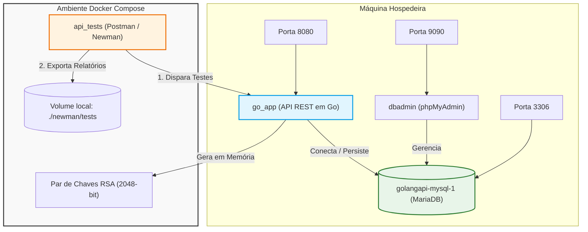

# API Go (Golang) - Guia de Construção, Arquitetura e Estrutura

Este repositório contém a base e os recursos para a migração/construção de uma API REST de alta performance desenvolvida em **Go (Golang)**, baseada em um contrato OpenAPI e validada via testes de integração automatizados (Newman/Postman).

---

## 1. Arquitetura da Infraestrutura (Diagrama Mermaid)

O fluxo de dados, conectores e orquestração de containers no ecossistema Docker Compose estão modelados no diagrama abaixo:



### Componentes de Infraestrutura:
- **`mysql` (MariaDB)**: Banco de dados relacional que persiste as informações da entidade `pessoa`. É inicializado automaticamente pela API Go caso a tabela ainda não exista.
- **`app` (`go_app`)**: O servidor HTTP desenvolvido em Go usando a biblioteca Echo. Genericamente construído para substituir a antiga referência em Java (`java_app`).
- **`phpadmin` (`dbadmin`)**: Interface administrativa web do banco de dados, mapeada localmente na porta `9090`.
- **`newman` (`api_tests`)**: Runner de testes do Postman que valida todos os endpoints de negócio, limites de validação de payload, autenticação JWT, tratamento de erros 404/401 e conformidade de contrato.

---

## 2. Estrutura de Código Organizada

Para garantir manutenções futuras limpas e elegantes, todo o código em Go foi concentrado e organizado sob a pasta `src/`:

*   **`src/`**: Diretório principal do código-fonte Go, rodando no pacote `main`.
    *   `src/main.go`: Ponto de entrada do sistema. Gerencia carregamento de ambientes, retry de conexões com o banco de dados, geração de chaves RSA em tempo de execução, middlewares (segurança JWT baseada em chave pública RSA, recuperador e logs estruturados) e endpoints de Actuator.
    *   `src/server.go`: Implementa os handlers HTTP definidos na interface gerada do OpenAPI. Conecta e valida parâmetros de entrada.
    *   `src/store.go`: Camada robusta de acesso a dados (Repository Pattern) que abstrai as queries SQL brutas para o banco MariaDB.
    *   `src/server_test.go`: Suite de testes unitários com Mock de banco de dados para garantir alta cobertura e segurança antes de compilar.
    *   `src/openapi.yaml`: Arquivo do contrato da especificação OpenAPI 3.0 utilizado e embutido estaticamente na API para servir o Swagger UI.
*   **`src/api/`**: Subpasta dedicada para isolar o pacote auto-gerado.
    *   `src/api/api.gen.go`: Scaffold de tipos, wrappers e interfaces geradas a partir do OpenAPI.
*   **`db/`**: Guarda os segredos de senhas de root e usuários do MariaDB (`pwd.txt`).
*   **`newman/`**: Suite de testes automatizados de integração:
    *   `tests/simple_spring_boot_rest_api.postman_collection.json`: Coleção de chamadas do Postman.
    *   `tests/test-docker.postman_environment.json` & `test-local.postman_environment.json`: Variáveis de ambientes locais ou do Docker Compose.
    *   `tests/newman/`: Pasta ignorada pelo git para salvar os relatórios extra em HTML.
*   **`Makefile`**: Orquestrador e simplificador de comandos locais de compilação, testes e cobertura.

---

## 3. Guia de Uso Rápidas (Utilizando o Makefile)

### Requisitos Prévios
- **Go (Golang)**: Versão `1.26` ou superior.
- **Docker & Docker Compose**: Para orquestração.
- **oapi-codegen**: Caso queira regerar código a partir do OpenAPI schema (`go install github.com/oapi-codegen/oapi-codegen/v2/cmd/oapi-codegen@latest`).
- **yq**: Utilitário YAML (`build.sh`).

### Comandos de Compilação Local e Qualidade de Código

O **`Makefile`** automatiza todos os comandos comuns de desenvolvimento local:

```bash
# 1. Copiar as configurações de ambiente
cp .env.example .env

# 2. Executar testes unitários locais
make test

# 3. Gerar relatório visual de cobertura de código no navegador (HTML)
make coverage

# 4. Compilar e gerar o executável binário local "api-server"
make build

# 5. Iniciar o servidor localmente
make run

# 6. Limpar binários locais e artefatos de testes
make clean
```

### Execução via Docker Compose (Integração de Ponta a Ponta)

Para iniciar toda a infraestrutura limpa, compilar a API em container e disparar os testes integrados com o Newman:

```bash
# Sobe banco MariaDB, phpMyAdmin, Go App, e executa os testes automatizados
docker compose up --build
```

Aguarde o container de testes `api_tests` finalizar. Ao término com sucesso, você verá no console:
`api_tests exited with code 0`

Todos os relatórios visuais HTML gerados pelo Newman e pelo gerador de cobertura de código do Go estão configurados no `.gitignore` para que **nunca sejam comitados por engano** no repositório.

---

## 4. Consulta e Visualização do Swagger UI

O servidor Go serve nativamente a documentação interativa baseada no Swagger UI:

- **Swagger UI Interativo**: `http://localhost:8080/swagger-ui` (ou na porta definida por `APP_PORT`).
- **Contrato OpenAPI (YAML)**: `http://localhost:8080/swagger-ui/openapi.yaml`.

Esta documentação é 100% autônoma e pública (bypassa a verificação de JWT), carregando dinamicamente a especificação OpenAPI 3.0 definida em `src/openapi.yaml` que foi embutida diretamente no executável final.
