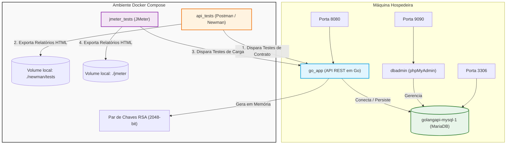

# API Go (Golang) - Guia de Construção, Arquitetura e Estrutura

Este repositório contém a base e os recursos para a migração/construção de uma API REST de alta performance desenvolvida em **Go (Golang)**, baseada em um contrato OpenAPI e validada via testes de integração automatizados (Newman/Postman) e testes de carga (JMeter).

---

## 📚 Documentos Relacionados do Projeto

Abaixo estão os guias de desenvolvimento e conformidade fundamentais deste projeto:

- 📋 [**GEMINI.md** (Mandatos Fundamentais e Diretrizes do Projeto)](GEMINI.md): Regras de desenvolvimento, layouts de pacotes e convenções de código que possuem precedência absoluta.
- 🚀 [**ANTIGRAVITY.md** (Guia de Reprodução Automática)](ANTIGRAVITY.md): Checklist detalhado e passo-a-passo para reconstruir e rodar a API Go a partir do contrato OpenAPI.

---

## 1. Arquitetura da Infraestrutura (Diagrama Mermaid)

O fluxo de dados, conectores e orquestração de containers no ecossistema Docker Compose estão modelados no diagrama abaixo:


```mermaid
graph TD
    subgraph Host ["Máquina Hospedeira"]
        P_PMA["Porta 9090"] --> PMA["dbadmin (phpMyAdmin)"]
        P_APP["Porta 8080"] --> APP["go_app (API REST em Go)"]
        P_DB["Porta 3306"] --> DB[("golangapi-mysql-1 (MariaDB)")]
    end

    subgraph Docker_Compose ["Ambiente Docker Compose"]
        PMA -- "Gerencia" --> DB
        
        APP -- "Conecta / Persiste" --> DB
        APP -- "Gera em Memória" --> RSA["Par de Chaves RSA (2048-bit)"]
        
        NEWMAN["api_tests (Postman / Newman)"] -- "1. Dispara Testes de Contrato" --> APP
        NEWMAN -- "2. Exporta Relatórios HTML" --> VOL_NEWMAN[("Volume local: ./newman/tests")]
        
        JMETER["jmeter_tests (JMeter)"] -- "3. Dispara Testes de Carga" --> APP
        JMETER -- "4. Exporta Relatórios HTML" --> VOL_JMETER[("Volume local: ./jmeter")]
    end

    style Docker_Compose fill:#f9f9f9,stroke:#333,stroke-width:2px
    style APP fill:#e1f5fe,stroke:#039be5,stroke-width:2px
    style DB fill:#e8f5e9,stroke:#2e7d32,stroke-width:2px
    style NEWMAN fill:#fff3e0,stroke:#ef6c00,stroke-width:2px
    style JMETER fill:#f3e5f5,stroke:#8e24aa,stroke-width:2px
```

### Componentes de Infraestrutura configurados no [docker-compose.yml](docker-compose.yml):
- **`mysql` (MariaDB)**: Banco de dados relacional que persiste as informações da entidade `pessoa`. Inicializado automaticamente pela API Go caso a tabela ainda não exista.
- **`app` (`go_app`)**: O servidor HTTP de alta performance desenvolvido em Go usando a biblioteca Echo.
- **`phpadmin` (`dbadmin`)**: Interface administrativa web do banco de dados, mapeada localmente na porta `9090`.
- **`newman` (`api_tests`)**: Runner do Postman que executa os testes de integração para verificar conformidade do contrato.
- **`jmeter` (`jmeter_tests`)**: Ferramenta de teste de performance que dispara requisições concorrentes e gera relatórios em tempo real.

---

## 2. Estrutura de Código Organizada

Para garantir manutenções futuras limpas e elegantes, todo o código em Go foi concentrado e organizado sob a pasta `src/`:

*   **`src/`**: Diretório principal do código-fonte Go, rodando no pacote `main`.
    *   [src/main.go](src/main.go): Ponto de entrada do sistema. Gerencia carregamento de ambientes, retry de conexões com o banco de dados, geração de chaves RSA em tempo de execução, middlewares (segurança JWT baseada em chave pública RSA, recuperador e logs estruturados) e endpoints de Actuator.
    *   [src/server.go](src/server.go): Implementa os handlers HTTP definidos na interface gerada do OpenAPI. Conecta e valida parâmetros de entrada.
    *   [src/store.go](src/store.go): Camada robusta de acesso a dados (Repository Pattern) que abstrai as queries SQL brutas para o banco MariaDB.
    *   [src/server_test.go](src/server_test.go): Suite de testes unitários com Mock de banco de dados para garantir alta cobertura e segurança antes de compilar.
    *   [src/openapi.yaml](src/openapi.yaml): Arquivo do contrato da especificação OpenAPI 3.0 utilizado e embutido estaticamente na API para servir o Swagger UI.
*   **`src/api/`**: Subpasta dedicada para isolar o pacote auto-gerado.
    *   [src/api/api.gen.go](src/api/api.gen.go): Scaffold de tipos, wrappers e interfaces geradas a partir do OpenAPI.
*   **`db/`**: Guarda os segredos de senhas de root e usuários do MariaDB ([db/pwd.txt](db/pwd.txt)).
*   **`newman/`**: Suite de testes automatizados de integração:
    *   [simple_spring_boot_rest_api.postman_collection.json](newman/tests/simple_spring_boot_rest_api.postman_collection.json): Coleção de chamadas do Postman.
    *   [test-docker.postman_environment.json](newman/tests/test-docker.postman_environment.json) & [test-local.postman_environment.json](newman/tests/test-local.postman_environment.json): Variáveis de ambientes locais ou do Docker Compose.
*   **`jmeter/`**: Suite de testes de carga e performance:
    *   [springbootapi.jmx](jmeter/springbootapi.jmx): Script de testes do JMeter configurado com asserções de validação de contrato equivalentes ao Postman.
*   [Makefile](Makefile): Orquestrador e simplificador de comandos locais de compilação, testes e cobertura.

---

## 3. Guia de Uso Rápido

### Requisitos Prévios
- **Go (Golang)**: Versão `1.26` ou superior.
- **Docker & Docker Compose**: Para orquestração.
- **oapi-codegen**: Caso queira regerar código a partir do OpenAPI schema (`go install github.com/oapi-codegen/oapi-codegen/v2/cmd/oapi-codegen@latest`).
- **yq**: Utilitário YAML ([build.sh](build.sh)).

### Comandos de Compilação Local e Qualidade de Código

O [Makefile](Makefile) automatiza todos os comandos comuns de desenvolvimento local:

```bash
# 1. Copiar as configurações de ambiente
cp .env.example .env

# 2. Executar testes unitários locais
make test

# 3. Gerar relatório visual de cobertura de código no navegador (HTML)
make coverage

# 4. Compilar e gerar o executável binário local "api-server"
make build

# 5. Iniciar o servidor localmente
make run

# 6. Limpar binários locais e artefatos de testes
make clean
```

### Execução via Docker Compose (Integração de Ponta a Ponta)

Para iniciar toda a infraestrutura limpa, compilar a API em container e disparar os testes integrados:

```bash
# Sobe banco MariaDB, phpMyAdmin, Go App, executa o Newman e em seguida roda o JMeter
docker compose up --build
```

- **Newman:** O container de testes `api_tests` executará 10 iterações e gerará um relatório HTML em `newman/tests/newman/`. Ao término com sucesso, você verá: `api_tests exited with code 0`.
- **JMeter:** O container `jmeter_tests` iniciará automaticamente após o sucesso do Newman, disparando testes de carga de 10 threads durante 30 segundos, validando códigos HTTP e asserções JSON. O relatório gráfico interativo em HTML será gerado na pasta `jmeter/reports/`.

---

## 4. Consulta e Visualização do Swagger UI

O servidor Go serve nativamente a documentação interativa baseada no Swagger UI:

- **Swagger UI Interativo**: `http://localhost:8080/swagger-ui` (ou na porta definida por `APP_PORT`).
- **Contrato OpenAPI (YAML)**: `http://localhost:8080/swagger-ui/openapi.yaml`.

Esta documentação é 100% autônoma e pública (bypassa a verificação de JWT), carregando dinamicamente a especificação OpenAPI 3.0 definida em [src/openapi.yaml](src/openapi.yaml) que foi embutida diretamente no executável final.

---

## 5. 🚀 Ajuste de Performance e Pool de Conexões (Testes de Carga / JMeter)

Durante testes de carga pesados ou prolongados no **JMeter** (ex: 100+ threads por longos períodos), a aplicação Go pode sofrer exaustão de sockets TCP e portas locais devido à alta taxa de conexões abertas e fechadas constantemente.

Para evitar esses gargalos de concorrência e exaustão de recursos, a API conta com uma camada configurável de **Pool de Conexões** no banco de dados (`sql.DB`), eliminando o churn de conexões:

### Configurações de Ajuste (Tuning) no `.env`:
Você pode definir e ajustar essas variáveis diretamente no arquivo `.env` para adequar aos seus testes de performance:

*   **`DB_MAX_OPEN_CONNS`**: O limite de conexões simultâneas que a aplicação pode abrir no banco (Default: `100`). Evita estourar o limite padrão do banco de dados (geralmente `151` no MariaDB).
*   **`DB_MAX_IDLE_CONNS`**: O número de conexões inativas que a aplicação mantém abertas no pool para reuso imediato (Default: `50`). Evita o fechamento e reabertura constante de sockets TCP.
*   **`DB_CONN_MAX_LIFETIME`**: Tempo máximo de vida de uma conexão no pool (Default: `5m`).
*   **`DB_CONN_MAX_IDLE_TIME`**: Tempo máximo que uma conexão pode ficar ociosa antes de ser descartada (Default: `2m`).

Isso garante que a aplicação mantenha uma latência extremamente baixa e estabilidade sob alta concorrência contínua, mesmo em execuções prolongadas do JMeter.
